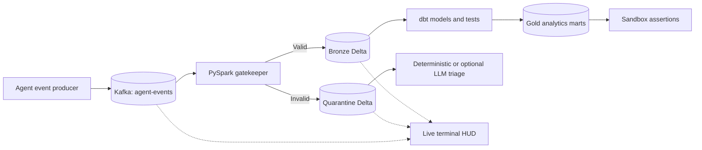

# Agentic Delta Guard

A Kafka-to-Delta data quality pipeline for AI-agent tool execution events. The project validates streaming records against a YAML contract, routes invalid events to quarantine, builds analytical marts with dbt, and exposes operational state through a real-time terminal HUD.

## What It Does



The complete architecture, data-flow diagrams, deployment notes, and failure handling are documented in [docs/ARCHITECTURE.md](docs/ARCHITECTURE.md).

## Capabilities

- Kafka `agent-events` ingestion with Docker Compose.
- PySpark Structured Streaming validation using distributed DataFrame expressions.
- Contract checks for required identifiers, numeric cost, cost bounds, and timestamp freshness.
- Idempotent Bronze Delta merge on `agent_id`, `session_id`, and `action_id`.
- Quarantine Delta storage with structured `error_summary` values.
- dbt staging views and analytical marts in DuckDB.
- Deterministic quarantine triage with optional OpenAI or Anthropic enrichment.
- Sandbox assertion checks for schema, costs, success rates, and row growth.
- Real-time Textual HUD for Kafka, Delta, host health, and incident signals.
- GitHub Actions validation on pushes and pull requests.

## Project Layout

| Path | Purpose |
| --- | --- |
| `src/delta_guard/producer.py` | Generates valid and deliberately invalid agent events |
| `src/delta_guard/gatekeeper.py` | Validates Kafka events and writes Bronze/Quarantine Delta tables |
| `src/delta_guard/hud.py` | Real-time terminal operations dashboard |
| `src/delta_guard/triage.py` | Groups and diagnoses quarantined records |
| `src/delta_guard/sandbox_guard.py` | Runs sandbox mutations and promotion assertions |
| `src/delta_guard/benchmark.py` | Generates the storage benchmark report |
| `configs/agent_contract.yaml` | Event contract and quality rules |
| `dbt_delta_guard/` | dbt project, profiles, models, and tests |
| `data/` | Local Delta, Parquet, and DuckDB data |
| `docs/` | Architecture, incident, quality, and benchmark reports |
| `tests/` | Pytest chaos and invariant suite |
| `.github/workflows/ci.yml` | GitHub Actions workflow |

## Prerequisites

- Python 3.10 or newer; Python 3.11 is used by CI.
- Java 17 for PySpark and Delta Lake.
- Docker Desktop with Docker Compose.
- GNU Make, or run the equivalent Python/PowerShell commands directly on Windows.

## Quick Start

### Windows PowerShell

```powershell
# Create and activate an isolated environment
py -3.11 -m venv .venv
.\.venv\Scripts\Activate.ps1

# Install runtime and development dependencies
python -m pip install --upgrade pip
python -m pip install -r requirements.txt
python -m pip install dbt-core dbt-duckdb pytest

# Start Kafka, ZooKeeper, and Kafka UI
docker compose up -d

# In separate terminals, run the producer, gatekeeper, and HUD
python src/delta_guard/producer.py
$env:KAFKA_BOOTSTRAP_SERVERS = "localhost:9092"
python src/delta_guard/gatekeeper.py
python src/delta_guard/hud.py
```

Kafka UI is available at [http://localhost:8080](http://localhost:8080). Host processes use `localhost:9092`; containers use `kafka:29092`.

### Make

```text
make install
make up
make produce       # terminal 1
make gatekeeper    # terminal 2
make hud           # terminal 3
```

Use `make help` to see the full command list.

## Verification

Run the focused chaos and invariant suite:

```powershell
python -m pytest tests/test_chaos_suite.py -v --tb=short
```

Run the complete local CI sequence on Windows:

```powershell
powershell -ExecutionPolicy Bypass -File .\test_ci_locally.ps1
```

The local CI sequence validates the contract, installs dbt packages, compiles dbt, runs pytest, checks sandbox assertions, runs triage, and writes the storage benchmark report.

Using Make:

```text
make validate
make dbt-compile
make dbt-test
make quality-report
make benchmark
make test
```

## dbt Models

The dbt project uses the DuckDB profile at `dbt_delta_guard/profiles.yml` and writes to `data/bronze/dbt_delta_guard.duckdb`.

```powershell
cd dbt_delta_guard
dbt deps --profiles-dir .
dbt run --profiles-dir .
dbt test --profiles-dir .
```

The project contains a staging view and analytical marts including `fct_agent_activity` and `dim_tool_efficiency`.

## Triage and Optional LLM Enrichment

Triage runs deterministically by default and writes incident output to `docs/INCIDENT_LOG.md`. It can optionally call OpenAI or Anthropic when the corresponding environment variable is configured:

```powershell
$env:OPENAI_API_KEY = "..."
# or
$env:ANTHROPIC_API_KEY = "..."
python src/delta_guard/triage.py
```

Do not commit API keys. Deterministic mode remains the CI-safe default.

## Reports and Artifacts

- `docs/INCIDENT_LOG.md`: quarantine diagnosis and recommended contract changes.
- `docs/reports/quality_audit.md`: dbt quality audit.
- `docs/reports/quality_report.json`: machine-readable quality results.
- `docs/reports/storage_benchmark.md`: non-destructive storage footprint report.
- `data/bronze/agent_events`: contract-passed Delta records.
- `data/quarantine/agent_events`: rejected records and validation signatures.

## CI/CD

GitHub Actions runs on pushes and pull requests targeting `main` or `master`. The workflow installs Python 3.11 and Java 17, validates the contract, installs and compiles dbt, runs the chaos suite, checks sandbox and triage behavior, and uploads reports as artifacts.

See [.github/workflows/ci.yml](.github/workflows/ci.yml).

## Stop and Clean Up

```text
make down
make clean
```

`make clean` removes generated local reports, dbt targets, caches, sandbox data, and proposed contract output. It does not remove source code, the checked-in contract, or the Bronze/Quarantine tables unless explicitly requested by a separate command.

## License

This repository is an internal engineering project. Add the applicable license before external distribution.
