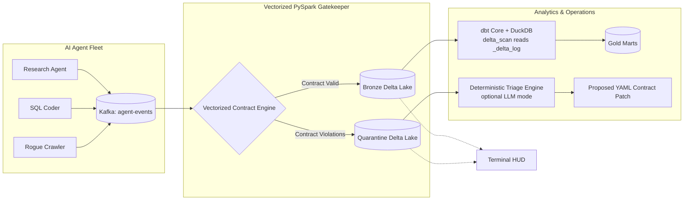
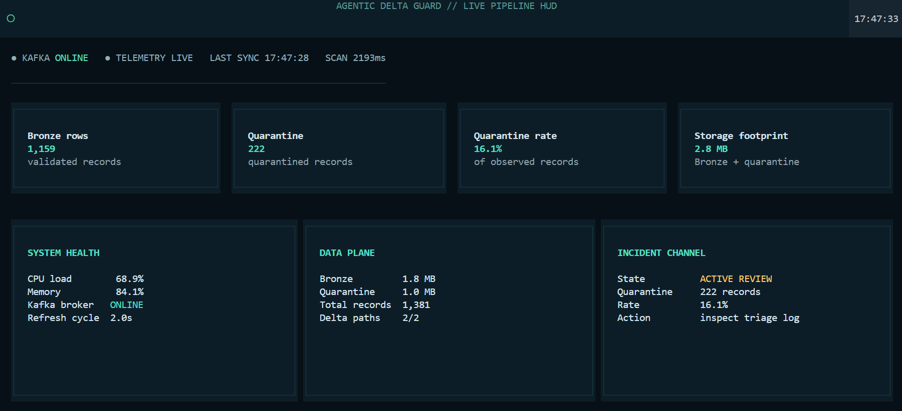

# 🛡️ Agentic Delta Guard

**A data-contract gate for AI-agent event streams: validates events against a YAML contract, quarantines violations without stalling the stream, and proposes YAML contract patches from the failures.**

[](https://github.com/laila-kz/agentic-delta-guard/actions/workflows/ci.yml)
[](https://delta.io/)
[](https://getdbt.com)

> 🌐 **Interactive Simulation (no live pipeline):** [https://agentic-delta-guard.vercel.app](https://agentic-delta-guard.vercel.app)

---

## Architecture




*Figure: Real-time Textual terminal HUD monitoring Kafka connection status, Bronze commits, Quarantine routing, and cluster resource utilization.*

> **Scope:** The deterministic validation path, quarantine routing, dbt/DuckDB analytics, and idempotent merge are implemented and tested. End-to-end Kafka-to-Delta routing in a live cluster and live LLM enrichment are opt-in and not exercised in CI. See [Limitations](#limitations) and [docs/CLAIMS.md](docs/CLAIMS.md) for verification evidence.

---

## What It Does

### 1. Event Contract (`configs/agent_contract.yaml`)

Every agent event is validated against a single YAML contract. A valid payload committed to Bronze:

```yaml
# Compliant event — committed to Bronze Delta table
agent_id:          "agent_008"
session_id:        "2352e973-51de-462d-bc81-a17804a8f8c5"
action_id:         "462cdc67-c7c3-4a6e-830f-4cfcec22a9a3"
timestamp:         "2026-09-22 21:49:03.157045"
tool_name:         "web_scraper"                          # must be one of allowed tools
execution_time_ms: 903
cost_usd:          0.183546                               # must be in [0.0, 50.0]
status:            "SUCCESS"
tool_args:         '{"query":"Or stuff generation style hour admit return.","limit":48}'
```

Contract rules enforced per micro-batch:
- All nine fields present; `agent_id`, `session_id`, `action_id` non-nullable.
- `tool_name` in `{sql_query_executor, vector_search, web_scraper, db_writer}`.
- `cost_usd` in `[0.0, 50.0]`.
- `timestamp` within a rolling 24-hour freshness window (not stale, not in the future).

### 2. Quarantined Record

Records failing contract rules are appended to the Quarantine Delta table with an `error_summary` diagnostic string without failing the micro-batch:

```json
{
  "agent_id":          null,
  "session_id":        "c7593eba-38fa-4bd6-b88b-dc6dfe7a0a45",
  "action_id":         "0744c95d-2f67-4a58-acf4-37255dbb3c7c",
  "timestamp":         "2026-09-22T21:48:20.308360+00:00",
  "tool_name":         "db_writer",
  "execution_time_ms": 488,
  "cost_usd":          "0.031163",
  "status":            "SUCCESS",
  "tool_args":         "{\"query\":\"Small stock focus note.\",\"limit\":12}",
  "quarantined_at":    "2026-09-22 21:49:57.118049",
  "error_summary":     "missing_required_field:agent_id"
}
```

DuckDB reads both Bronze and Quarantine tables directly via `delta_scan('../data/bronze/agent_events')`, reading the Delta `_delta_log` transaction log without requiring a Spark session for analytics.

### 3. Proposed YAML Contract Patch

The triage engine clusters quarantine signatures and writes proposed evolution patches to `configs/agent_contract_proposed.yaml`:

```yaml
# Generated patch — deterministic triage engine
# Quarantined records analysed: 221 across 6 error signatures

version: "1.1.0"
contract_id: agent_events_v1_proposed

semantic_rules:
  - id: cost_non_negative
    rule: "cost_usd >= 0.0 AND cost_usd <= 50.0"
    message: "cost_usd out of valid boundaries [0.0, 50.0]"

  - id: timestamp_freshness
    rule: "timestamp >= (current_timestamp() - INTERVAL 24 HOURS)
           AND timestamp <= (current_timestamp() + INTERVAL 5 MINUTES)"
    message: "timestamp violates rolling 24h freshness window or is in future"
```

*Note on signature counts:* Out of 221 quarantined records in the reference triage run, 60 cost violations and 50 timestamp freshness violations trigger semantic rule proposals, while the remaining 111 records represent structural schema anomalies (e.g., missing `agent_id` or non-numeric `cost_usd`).

Run `python src/delta_guard/triage.py` (or `make triage`) to regenerate proposals against the current Quarantine table.

---

## Quick Start

Two paths. Pick one.

### Path A — Streamlit demo (no Docker, no Spark)

```powershell
py -3.11 -m venv .venv
.\.venv\Scripts\Activate.ps1
pip install -r requirements-demo.txt
streamlit run demo_app.py
```

The interactive demo simulates the gateway's routing decisions with synthetic event replays. No Kafka or Spark cluster required.

### Path B — Full streaming pipeline (Docker + Spark)

```powershell
# Requires Docker Desktop and Java 11 or 17 (not 21+)
docker compose up -d    # starts Kafka (KRaft), Kafka UI, producer, gatekeeper, and web console
# Live console  → http://localhost:8888
# Kafka UI      → http://localhost:8080
docker compose down     # stop all services
```

*Note on `make`:* `Makefile` targets are provided for Linux/macOS/WSL environments. On native Windows, run the PowerShell equivalents shown above or via [`run_gatekeeper.ps1`](run_gatekeeper.ps1).

---

## Benchmarks

Measured using [`src/delta_guard/benchmark.py`](src/delta_guard/benchmark.py). Full methodology: [`docs/reports/storage_benchmark.md`](docs/reports/storage_benchmark.md).

| Metric | Measured Value | Scope & Test Environment |
| :--- | ---: | :--- |
| **Validation Throughput** | **45,254.19 ev/s** | Single-core Python in-process validation logic (1,000 synthetic events evaluated, no Kafka / Spark I/O overhead) |
| **P50 Latency** | 0.0041 ms | Per-event contract validation latency |
| **P95 Latency** | 0.0070 ms | Per-event contract validation latency |
| **P99 Latency** | 0.0115 ms | Per-event contract validation latency |
| **Poison Quarantine Rate** | 15.5% | Correctly routed to Quarantine (target: ~15% injected synthetic anomalies) |

*Environment:* Intel64 Family 6 Model 166 (x86_64), Windows 10/11, Python 3.11.9, 1,000-event workload.

> **Throughput note:** This benchmark measures the contract validation logic in pure Python on a single core. Real end-to-end throughput across Kafka → PySpark micro-batches → Delta disk commits will be lower due to network serialization, Spark task scheduling, and filesystem I/O. Throughput numbers vary across hardware (e.g. ~9.4k ev/s on lower-clock virtual cores, ~23.8k in CI runner VMs, and ~45.2k on bare-metal desktop CPU).

---

## Design Decisions

### Idempotent retry handling

Distributed agents retrying tool executions generate duplicate events sharing the same composite key `(agent_id, session_id, action_id)`.

Two mechanisms provide resilience:

1. **Delta Lake `MERGE INTO`** — keyed on `(agent_id, session_id, action_id)`:
   - When not matched → insert new event row into Bronze.
   - When matched → **leave existing row unchanged** (`whenNotMatchedInsertAll()`), dropping duplicate deliveries.

2. **In-batch deduplication & watermarking** — `dropDuplicates(["agent_id", "session_id", "action_id"])` removes duplicates within a micro-batch. Inside `foreachBatch`, the DataFrame is static; cross-batch idempotency across restarts is guaranteed by the downstream Delta `MERGE INTO`.

Verified in [`tests/test_chaos_infra.py`](tests/test_chaos_infra.py) under synthetic checkpoint wipes and retry storm bursts.

> *Scope:* This handles idempotent retries (identical composite key, duplicate arrival). It does not reorder late out-of-sequence events with timestamps newer than stored state.

### PySpark Catalyst expression validation

Validation rules in `src/delta_guard/gatekeeper.py` are implemented using native PySpark DataFrame column expressions (`F.when`, `F.filter`, `F.array`), executing directly inside the JVM on executor nodes with zero Python row-by-row UDF overhead.

### Bronze / Quarantine → dbt / DuckDB handoff

Bronze and Quarantine tables are committed as native Delta Lake tables by PySpark. The analytical dbt layer reads them using DuckDB's `delta` extension:

```sql
-- dbt_delta_guard/models/staging/stg_agent_events.sql
from delta_scan('../data/bronze/agent_events')
```

`delta_scan` reads the Delta `_delta_log` transaction log to discover active Parquet data files without starting a Spark session. The DuckDB profile (`dbt_delta_guard/profiles.yml`) uses `type: duckdb` locally and can be configured with `type: spark` for distributed deployments.

### Delta sandbox mutation testing

`src/delta_guard/sandbox_guard.py` executes mutation testing against an isolated copy of Bronze data. The portable default creates an **independent Delta snapshot**. Native Spark `SHALLOW CLONE` (zero-copy metadata cloning) requires a working Spark + Delta runtime with native Hadoop binaries (`winutils.exe` on Windows), and is executed when that environment is present.

### Deterministic triage; optional LLM mode

`src/delta_guard/triage.py` operates deterministically by default: it clusters quarantine records by `error_summary`, evaluates cost/freshness/schema-drift heuristics, and writes proposed YAML patches. When `OPENAI_API_KEY` or `ANTHROPIC_API_KEY` is provided, it calls the LLM provider for enriched diagnosis. **CI and automated tests always execute the deterministic fallback path without external network dependencies or API token costs.**

### Vercel console

The deployment at `https://agentic-delta-guard.vercel.app` is an **interactive simulation** of the gateway's behavior using pre-rendered event particle animations. Vercel hosts static frontend assets; no live Kafka or Spark infrastructure runs on Vercel.

---

## Project Structure

<details>
<summary>Expand file table</summary>

| Path | Purpose |
| :--- | :--- |
| `configs/agent_contract.yaml` | Single source of truth — contract rules consumed by gatekeeper and dbt |
| `src/delta_guard/gatekeeper.py` | PySpark Structured Streaming engine: validates and routes Bronze / Quarantine |
| `src/delta_guard/producer.py` | Synthetic agent event generator with ~15% injected poison records |
| `src/delta_guard/triage.py` | Deterministic triage + optional LLM mode; generates proposed YAML patches |
| `src/delta_guard/benchmark.py` | Reproducible validation-throughput and storage footprint benchmark |
| `src/delta_guard/sandbox_guard.py` | Mutation testing against Delta snapshots / shallow clones |
| `src/delta_guard/hud.py` | Real-time Textual terminal dashboard |
| `dbt_delta_guard/` | dbt models + DuckDB profiles; staging reads Bronze via `delta_scan` |
| `demo_app.py` | Streamlit gateway simulation — no Docker or Spark required |
| `tests/test_contract_validation.py` | Contract rule and triage unit tests |
| `tests/test_chaos_infra.py` | Checkpoint-wipe, retry-burst, and late-event infrastructure tests |
| `tests/test_delta_clone_utils.py` | Sandbox clone and idempotent merge tests |
| `tests/test_mcp_server.py` | MCP contract-proposal endpoint tests |
| `docs/CLAIMS.md` | Verification matrix mapping all claims to source files and tests |
| `docs/reports/` | Auto-generated benchmark, quality, and triage audit reports |

</details>

---

## Test Suite

```powershell
python -m pytest tests/ -v --tb=short
```

### Skipped tests

The test suite collects **38 test cases** (35 passed, 3 skipped on Windows host; 36 passed in Linux CI):

| Test | Module | Marker | Reason for Skip | How to Enable |
| :--- | :--- | :--- | :--- | :--- |
| `test_gatekeeper_error_array_keeps_valid_rows_writable` | `test_chaos_infra.py` | `sys.platform == "win32"` | Local PySpark worker connection constraint on Windows; runs in Linux CI | Run in Linux / WSL / Docker |
| `test_gatekeeper_survives_broker_restart` | `test_chaos_infra.py` | `requires_docker` | Requires active Docker Compose cluster | `CHAOS_DOCKER_TESTS=1` |
| `test_llm_triage_with_openai` | `test_contract_validation.py` | `requires_llm` | Requires OpenAI API key and explicit opt-in | `LIVE_LLM_TEST=1` + `OPENAI_API_KEY` |

---

## Limitations

- **Throughput is single-node validation logic:** ~45k ev/s measures in-process Python validation only. End-to-end Kafka-to-Delta streaming throughput is not claimed.
- **LLM triage untested in CI:** The deterministic path is exercised in CI. Live LLM enrichment is opt-in (`LIVE_LLM_TEST=1`).
- **Sandbox portability:** Portable `SandboxGuard` uses an independent Delta snapshot. Native shallow clone requires a Spark/Delta runtime with native Hadoop support.
- **Single-broker footprint:** Evaluated on a single Docker Compose KRaft broker.
- **MCP server:** `run_mcp_server.py` is tested in `tests/test_mcp_server.py` with `MCP_PROPOSAL_TOKEN` gating; this is a local review workflow, not production IAM.
- **Video asset:** `docs/screenshots/console_demo.mp4` is stored in the repository.

---

## License

[LGPL-2.1](LICENSE)
