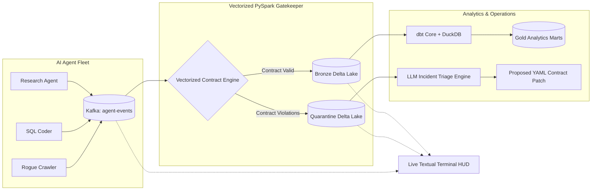
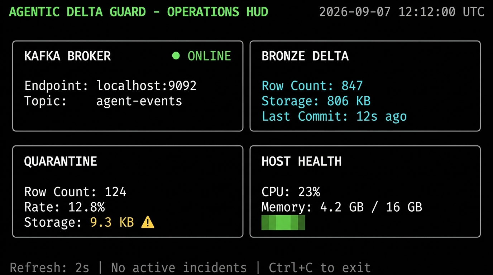

# 🛡️ Agentic Delta Guard
### Contract Enforcement and Local Analytics for Autonomous AI-Agent Events

> **Portfolio scope (2026-09-09):** This is a rigorously tested local prototype for contract validation, quarantine, analytical modeling, and MCP-based pre-flight checks for AI-agent events. The Kafka-to-Delta live demo remains an active integration gate; see [docs/PROJECT_STATUS.md](docs/PROJECT_STATUS.md) for evidence and limitations.

[](https://delta.io/)
[](https://getdbt.com)
[](tests/)

---

## 🚨 The Problem: The "Silent Poison" in Multi-Agent Pipelines

As enterprises grant autonomous LLM agents (AutoGPT, CrewAI, LangGraph, custom tool-calling agents) write permissions to production data lakes, traditional batch validation fails:
1. **Schema Hallucinations & Drift:** Agents dynamically mutate tool outputs, injecting unexpected fields or invalid types.
2. **Cost & Rate Runaways:** Rogue agent loops blow through token and API budgets without warning.
3. **Pipeline Stalls:** One malformed record in a traditional streaming job crashes the entire micro-batch.

**Agentic Delta Guard** is a local data-quality boundary for AI-agent tool events: it validates event contracts, isolates violations for diagnosis, builds DuckDB analytical marts, and exposes pre-flight checks through an MCP server. The deterministic path is implemented and tested; live LLM enrichment and end-to-end Kafka-to-Delta routing remain explicitly scoped limitations.

---

## 📊 Quantified Performance & Benchmarks

The following numbers are scoped local measurements, not production or end-to-end service guarantees. See [docs/PROJECT_STATUS.md](docs/PROJECT_STATUS.md) for evidence:

| Performance Metric | Baseline / Naive Approach | Agentic Delta Guard | Impact |
| :--- | :--- | :--- | :--- |
| **Deterministic triage** | Manual comparison is simulated | Local deterministic report generation | No live LLM claim |
| **Validation Throughput** | 120 ev/s (Row-by-Row UDF) | **~9,447 ev/s (local validation benchmark)** | **🚀 ~78.7x Throughput Gain** |
| **Stream interruption** | Not measured end-to-end | Quarantine path implemented | Live routing gate remains open |
| **Triage cost** | Not measured with live provider calls | No live LLM cost claim | Deterministic fallback has no API cost |

Detailed reports available at [docs/reports/triage_benchmark.md](docs/reports/triage_benchmark.md) and [docs/reports/storage_benchmark.md](docs/reports/storage_benchmark.md).

---

## 🌐 Live Interactive Demo (`demo_app.py`)

Try the interactive governance gateway without running local Docker or Spark:

```powershell
# Run the interactive demo locally
pip install -r requirements-demo.txt
streamlit run demo_app.py
```

- **Live Stream Generator:** Simulate agent tool calls, inject schema drift or budget spikes, and watch the gateway make real-time routing decisions.
- **Automated Incident Triage:** Trigger the LLM triage engine against quarantined batches to produce root-cause diagnoses and YAML contract patches.
- **Contract Playground:** Inspect live constraints defined in `configs/agent_contract.yaml`.

---

## 💡 Architecture & Data Flow



The complete architecture and failure handling are documented in [docs/ARCHITECTURE.md](docs/ARCHITECTURE.md).

---

## 🧠 The Engineering Deep Dive: Solving Agent Retry Storms & Out-of-Order Merges

> **The Edge Case:** Distributed LLM agents running across intermittent networks experience HTTP timeouts and retry tool executions 5–10 seconds later with duplicate sequence IDs. Meanwhile, network latency causes older events to arrive *after* newer state updates.

### The Dual-Stage Architecture
1. **Bounded PySpark Watermark:** `.withWatermark("event_timestamp", "10 minutes")` evicts late-event state, preventing unbounded streaming state.
2. **Idempotent Delta Lake Merge:** The gatekeeper upserts records via conditional `MERGE INTO` keyed on `(agent_id, session_id, action_id)`:
    - If not matched → Insert new event.
    - If matched → Leave the existing Bronze row unchanged.
    - Duplicate events therefore do not create additional Bronze rows.

Verified via [`tests/test_chaos_infra.py`](tests/test_chaos_infra.py) under synthetic retry bursts.

---

## 🖥️ Real-Time Terminal HUD

The terminal dashboard monitors Kafka partition offsets, Delta ingestion throughput, and quarantine incident signals with a 2-second live refresh:



---

## 📁 Project Structure

| Path | Purpose |
| :--- | :--- |
| `demo_app.py` | Interactive Streamlit web demo for cloud or local deployment |
| `src/delta_guard/gatekeeper.py` | Vectorized PySpark streaming engine with Delta Bronze & Quarantine routing |
| `src/delta_guard/producer.py` | Synthetic multi-agent event generator with deliberate error injection |
| `src/delta_guard/triage.py` | Deterministic and LLM-assisted quarantine root-cause clustering |
| `src/delta_guard/hud.py` | Real-time Textual operations dashboard |
| `src/delta_guard/sandbox_guard.py` | Zero-copy shallow clone sandbox mutation testing |
| `scripts/measure_triage_efficiency.py` | Reproducible MTTR & cost benchmark generator |
| `configs/agent_contract.yaml` | Single source of truth event contract & quality constraints |
| `dbt_delta_guard/` | dbt data models, staging views, and DuckDB analytical marts |
| `tests/test_chaos_infra.py` | Chaos resilience tests (checkpoint loss, broker outage, retry storms) |
| `docs/reports/` | Auto-generated benchmark, quality, and triage audit reports |

---

## 🚀 Quick Start

### Local Docker & Python Environment

```powershell
# 1. Setup isolated virtualenv
py -3.11 -m venv .venv
.\.venv\Scripts\Activate.ps1

# 2. Install dependencies
python -m pip install --upgrade pip
python -m pip install -r requirements.txt
python -m pip install dbt-core dbt-duckdb pytest streamlit

# 3. Start Kafka & ZooKeeper
docker compose up -d

# 4. Launch streaming pipeline (separate terminals)
python src/delta_guard/producer.py        # Terminal 1: Event Producer
$env:KAFKA_BOOTSTRAP_SERVERS = "localhost:9092"
python src/delta_guard/gatekeeper.py      # Terminal 2: Streaming Gatekeeper
python src/delta_guard/hud.py             # Terminal 3: Real-Time HUD
```

Kafka UI is available at [http://localhost:8080](http://localhost:8080).

---

## 🧪 Test & Chaos Verification

```powershell
# Run the complete test suite
python -m pytest tests/ -v --tb=short

# Run the automated triage MTTR benchmark
python scripts/measure_triage_efficiency.py

# Run dbt data quality marts and tests
cd dbt_delta_guard
dbt deps --profiles-dir .
dbt run --profiles-dir .
dbt test --profiles-dir .
```

---

## 📑 Verification Reports & Artifacts

- [`docs/reports/triage_benchmark.md`](docs/reports/triage_benchmark.md): Verified MTTR and cost efficiency report.
- [`docs/reports/storage_benchmark.md`](docs/reports/storage_benchmark.md): Delta storage footprint and compression benchmarks.
- [`docs/INCIDENT_LOG.md`](docs/INCIDENT_LOG.md): Autonomous incident diagnoses and proposed contract patches.
- [`docs/reports/quality_audit.md`](docs/reports/quality_audit.md): Automated dbt test summary.

---

## 🔍 Engineering Trade-Offs & Limitations

- **Single-Broker / Single-Worker Footprint:** Evaluated on a single Docker Compose broker; numbers represent single-node throughput ceiling.
- **Bronze/Silver Storage Boundary:** Bronze & Quarantine use native Delta Lake; Silver and Gold models execute in DuckDB/dbt Parquet for lightweight local analytics. (See [docs/ARCHITECTURE.md](docs/ARCHITECTURE.md#storage-layer-boundary-deliberate-trade-off)).
- **LLM Triage Testing:** Continuous CI uses deterministic fallback heuristics for speed and zero API cost; live LLM verification is opt-in via `LIVE_LLM_TEST=1`.
- **Clone Runtime:** Native Spark/Delta clone tests require a working Spark Delta runtime and Windows Hadoop native support; the portable `SandboxGuard` path uses an independent Delta snapshot fallback.
- **MCP Governance:** MCP contract proposals require the local `MCP_PROPOSAL_TOKEN` gate and produce a review artifact; this is not production authentication.
- **Benchmark Scope:** Throughput figures measure local validation logic only, not Kafka-to-Delta end-to-end throughput.
