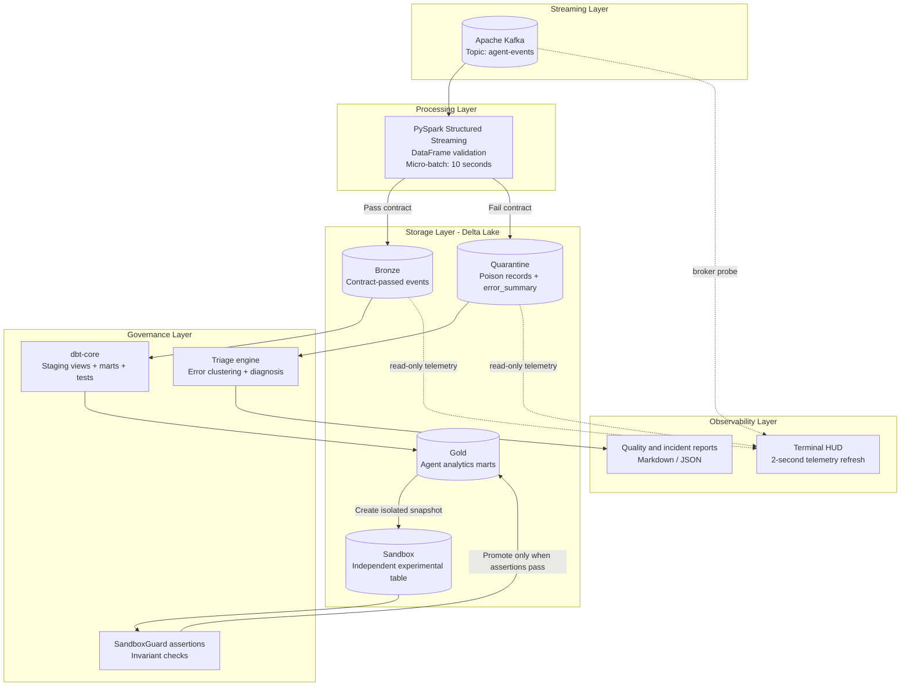
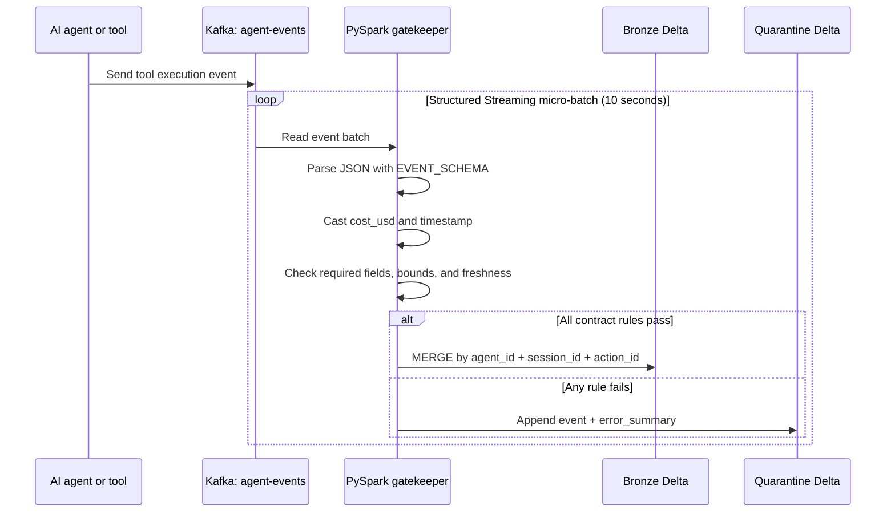
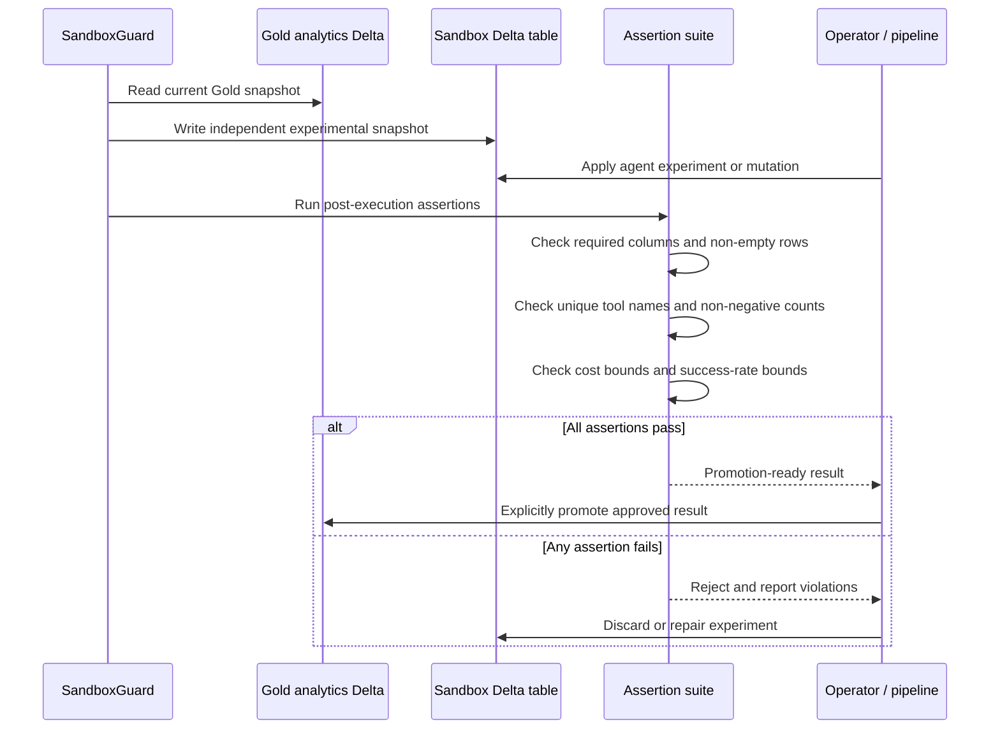
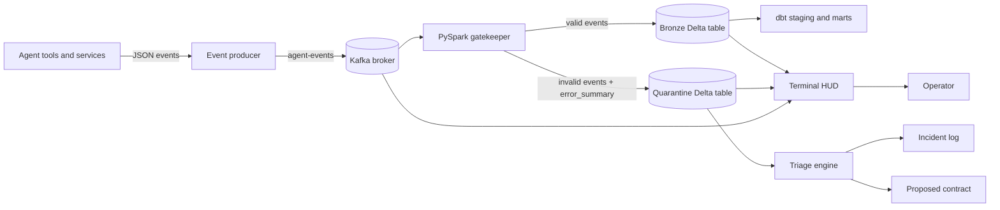
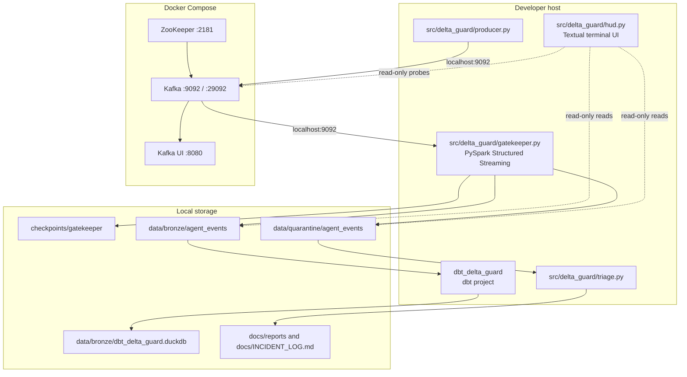
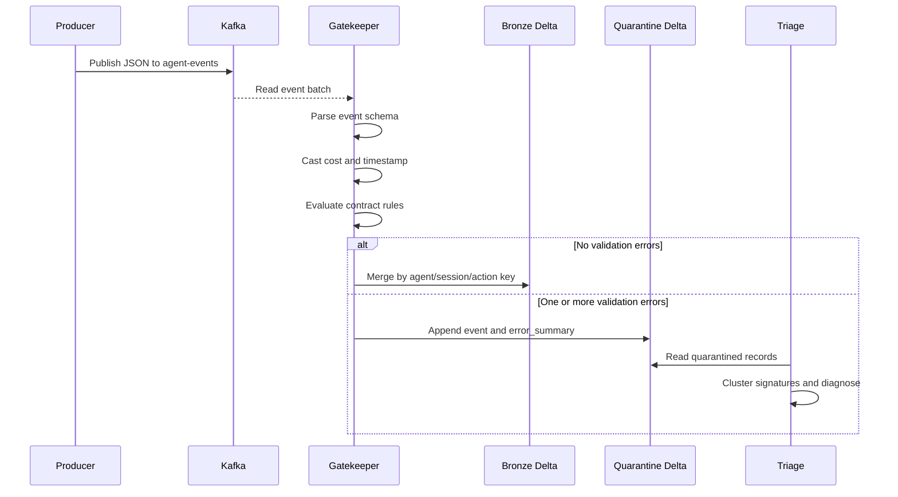
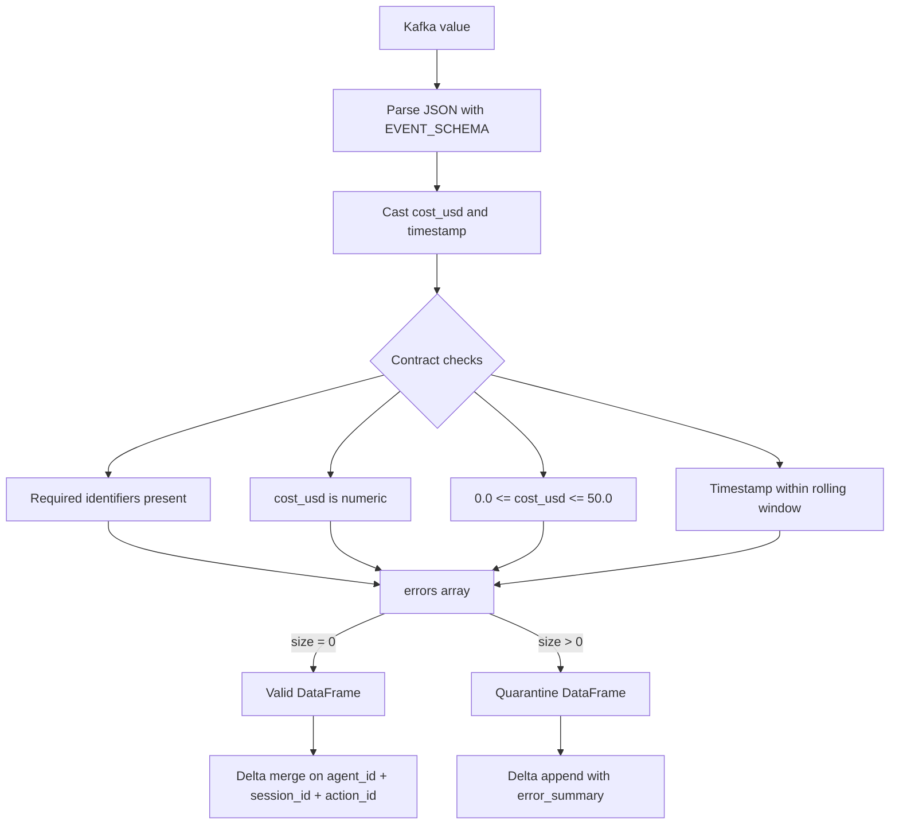
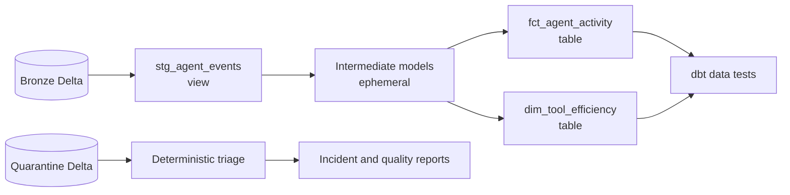
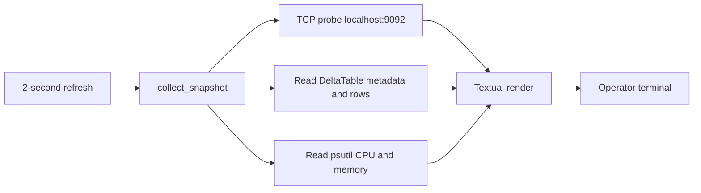

# Agentic Delta Guard Architecture

## Purpose

Agentic Delta Guard is a streaming data-quality boundary for AI-agent tool events. It accepts events from Kafka, validates them against the data contract in a distributed Spark job, and writes valid and invalid records to separate Delta Lake tables.

The design favors:

- **Early validation:** malformed or unsafe events are isolated before they reach analytical models.
- **Replayability:** Kafka offsets and Delta transaction logs provide durable processing state.
- **Operational visibility:** the terminal HUD reads live broker and Delta-table health without mutating pipeline data.
- **Deterministic recovery:** quarantined events are grouped and diagnosed locally, with optional LLM enrichment when credentials are available.

## Recommended Architecture Views

These three diagrams are the primary views for presenting the system: the container topology, the contract-validation lifecycle, and the sandbox promotion loop. They use the names and behavior implemented in this repository.

### 1. Container Diagram



**Reading this view:** Kafka and Spark form the ingestion boundary; Bronze and Quarantine are the durable routing destinations; dbt owns analytical modeling; triage and sandbox assertions provide governance; the HUD and reports expose operational state.

### 2. Contract Validation Data Flow



The gatekeeper routes records with Spark DataFrame expressions and keeps processing distributed. Valid records are merged idempotently by the agent/session/action key; invalid records retain their validation signature for triage.

### 3. Sandbox Assertion and Promotion Flow



> **Implementation note:** the current `SandboxGuard.create_shallow_clone()` name is historical. It writes an independent Delta snapshot and does not use a storage-level zero-copy Delta shallow clone. Promotion is conditional in the guard workflow; the assertion code reports readiness and the caller controls the production action.

## System Context



The producer and HUD target the host endpoint `localhost:9092`. The gatekeeper defaults to the Compose-network endpoint `kafka:29092`; when it runs on the host, set `KAFKA_BOOTSTRAP_SERVERS=localhost:9092`. Docker Compose supplies Kafka, ZooKeeper, and Kafka UI for local development.

## Runtime Topology



### Network endpoints

| Context | Kafka endpoint | Purpose |
| --- | --- | --- |
| Host process | `localhost:9092` | Producer, gatekeeper, and HUD access |
| Compose network | `kafka:29092` | Container-to-container access |
| Kafka UI | `http://localhost:8080` | Topic and broker inspection |

## Event Lifecycle



## Validation Boundary

The gatekeeper performs validation in `process_batch` using Spark DataFrame expressions. It does not collect the streaming batch into driver memory.



The current contract boundary catches:

- Missing `agent_id`, `session_id`, or `action_id`.
- Non-numeric `cost_usd` values.
- Costs outside the inclusive range `[0.0, 50.0]`.
- Invalid, stale, or future timestamps.

## Storage and Modeling



The dbt project uses DuckDB for local analytical storage. Its configured materializations are:

| Layer | Materialization | Role |
| --- | --- | --- |
| Staging | View | Normalize and expose source events |
| Intermediate | Ephemeral | Reusable transformation logic |
| Marts | Table | Consumer-facing activity and efficiency models |

## Observability HUD

The terminal HUD is intentionally read-only. Every two seconds it probes the Kafka TCP endpoint and reads the current Delta tables using `deltalake`, then renders:

- Kafka broker status.
- Bronze row count and storage size.
- Quarantine row count and percentage of observed records.
- Total Bronze plus quarantine footprint.
- Host CPU and memory utilization.
- Incident state based on the quarantine population.



The HUD is an operational signal, not a replacement for the Delta transaction log, dbt tests, or incident report.

## Failure Handling

| Failure | Detection | Result | Operator action |
| --- | --- | --- | --- |
| Kafka unavailable | Producer/gatekeeper connection failure; HUD shows `OFFLINE` | No new events are processed | Start Compose services and inspect broker logs |
| Contract violation | Gatekeeper `errors` array | Event is appended to quarantine | Run triage and inspect `docs/INCIDENT_LOG.md` |
| Duplicate event | Bronze Delta merge key | Existing key is not inserted again | Review source identifiers if duplicates persist |
| dbt model/test failure | dbt command exit code | CI/local check fails | Inspect dbt logs and model test output |
| Triage provider unavailable | HTTP/API failure | Deterministic diagnosis is retained | Review the generated report without LLM enrichment |
| Missing Delta table | HUD shows zero rows/footprint | Telemetry remains available but incomplete | Check gatekeeper output and storage paths |

## Development and Verification Commands

```powershell
# Start Kafka, ZooKeeper, and Kafka UI
docker compose up -d

# Emit sample agent events
python src/delta_guard/producer.py

# Start the streaming gatekeeper
python src/delta_guard/gatekeeper.py

# Open the real-time terminal HUD
python src/delta_guard/hud.py

# Compile and test dbt models
cd dbt_delta_guard
dbt deps --profiles-dir .
dbt compile --profiles-dir .
dbt test --profiles-dir .

# Run the focused chaos suite
pytest tests/test_chaos_suite.py -v
```

The local CI helper also validates the contract, compiles dbt, runs the chaos suite, checks sandbox isolation, runs deterministic triage, and generates the storage benchmark report.

## Design Boundaries

- Kafka provides transport and replayable offsets; Delta Lake provides durable table state.
- The gatekeeper owns contract enforcement and routing, not analytical aggregation.
- dbt owns analytical transformations and assertions, not streaming ingestion.
- Triage owns quarantine diagnosis and proposed contract changes, not automatic production promotion.
- The HUD reports health and volume; it does not acknowledge, delete, or repair events.
