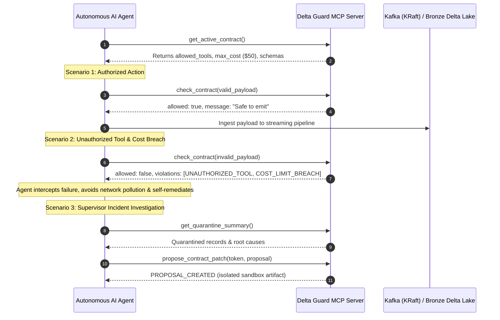

# 🤖 MCP Server Interaction Log: Shift-Left Agent Validation

**Generated At:** `2026-09-22T21:49:02.703492+00:00`  
**Protocol Version:** Model Context Protocol (MCP) v1.0.0  
**Target Architecture:** Agentic Delta Guard (`src/delta_guard/mcp/`)

This document captures an end-to-end verified interaction session between an autonomous AI agent / supervisor and the **Agentic Delta Guard MCP Server**.

By exposing data contract guardrails directly to autonomous LLM agents over the Model Context Protocol, agents self-validate their planned actions *before* sending payloads into streaming pipelines, achieving zero downstream data pollution (Shift-Left Data Engineering).

---

## 📋 Architecture & Sequence Workflow



---

## 1. Tool Discovery: `get_active_contract`

An autonomous agent queries the active data contract upon session initialization to dynamically discover permitted tools, cost ceilings, and validation thresholds.

### Request:
```json
{
  "method": "tools/call",
  "params": {
    "name": "get_active_contract",
    "arguments": {}
  }
}
```

### Live Server Response:
```json
{
  "contract": {
    "version": "1.0.0",
    "contract_id": "agent_events_v1",
    "description": "Data contract governing real-time AI agent tool execution logs ingested from Apache Kafka into Delta Lake Bronze.\n",
    "schema": {
      "fields": [
        {
          "name": "agent_id",
          "type": "string",
          "nullable": false
        },
        {
          "name": "session_id",
          "type": "string",
          "nullable": false
        },
        {
          "name": "action_id",
          "type": "string",
          "nullable": false
        },
        {
          "name": "timestamp",
          "type": "timestamp",
          "nullable": false
        },
        {
          "name": "tool_name",
          "type": "string",
          "nullable": false,
          "allowed_values": [
            "sql_query_executor",
            "vector_search",
            "web_scraper",
            "db_writer"
          ]
        },
        {
          "name": "execution_time_ms",
          "type": "integer",
          "nullable": false
        },
        {
          "name": "cost_usd",
          "type": "double",
          "nullable": false
        }
      ]
    },
    "semantic_rules": [
      {
        "id": "cost_non_negative",
        "rule": "cost_usd >= 0.0 AND cost_usd <= 50.0",
        "message": "cost_usd out of valid boundaries [0.0, 50.0]"
      },
      {
        "id": "timestamp_freshness",
        "rule": "timestamp >= (current_timestamp() - INTERVAL 24 HOURS) AND timestamp <= (current_timestamp() + INTERVAL 5 MINUTES)",
        "message": "timestamp violates rolling 24h freshness window or is in future"
      }
    ],
    "idempotency": {
      "key_fields": [
        "agent_id",
        "session_id",
        "action_id"
      ],
      "strategy": "merge_upsert"
    }
  },
  "contract_version": "1.0.0",
  "allowed_tools": [
    "db_writer",
    "sql_query_executor",
    "vector_search",
    "web_scraper"
  ],
  "max_cost_per_call": 50.0,
  "freshness_window_hours": 24,
  "loaded_at": "2026-09-22T21:49:02.853984+00:00",
  "contract_path": "C:\\Users\\kheza\\Desktop\\Data Engineering\\Agentic-Delta-Guard\\configs\\agent_contract.yaml"
}
```

---

## 2. Valid Pre-Flight Check: `check_contract` (Approved)

The agent tests a compliant action payload before streaming it to Kafka.

### Request:
```json
{
  "method": "tools/call",
  "params": {
    "name": "check_contract",
    "arguments": {
  "agent_id": "analytics-agent-01",
  "session_id": "sess-prod-789",
  "action_id": "act-val-101",
  "timestamp": "2026-09-22T21:49:02.703492+00:00",
  "tool_name": "vector_search",
  "execution_time_ms": 142,
  "cost_usd": 0.045,
  "status": "SUCCESS",
  "tool_args": {
    "query": "customer churn 2026",
    "top_k": 5
  }
}
  }
}
```

### Live Server Response:
```json
{
  "allowed": true,
  "violations": [],
  "remediation_hints": [],
  "contract_version": "1.0.0",
  "validation_timestamp": "2026-09-22T21:49:02.903712+00:00",
  "message": "Payload passes all data contract checks. Safe to emit to Kafka."
}
```

---

## 3. Policy Breach Interception: `check_contract` (Rejected)

The agent attempts to execute an unauthorized tool (`unauthorized_shell_exec`) with a cost of `$128.50` (exceeding the `$50.00` contract limit). The MCP validator intercepts and rejects the payload with remediation guidance.

### Request:
```json
{
  "method": "tools/call",
  "params": {
    "name": "check_contract",
    "arguments": {
  "agent_id": "rogue-agent-07",
  "session_id": "sess-prod-994",
  "action_id": "act-rej-662",
  "timestamp": "2026-09-22T21:49:02.703492+00:00",
  "tool_name": "unauthorized_shell_exec",
  "execution_time_ms": 420000,
  "cost_usd": 128.5,
  "status": "SUCCESS",
  "tool_args": {
    "cmd": "rm -rf /"
  }
}
  }
}
```

### Live Server Response:
```json
{
  "allowed": false,
  "violations": [
    "UNAUTHORIZED_TOOL: 'unauthorized_shell_exec' is not in allowed_tools list.",
    "COST_LIMIT_BREACH: $128.50 exceeds $50.00 ceiling."
  ],
  "remediation_hints": [
    "Use one of the authorized tools: [db_writer, sql_query_executor, vector_search, web_scraper] or request a contract patch.",
    "Optimize model token parameters or cap invocation cost below $50.00."
  ],
  "contract_version": "1.0.0",
  "validation_timestamp": "2026-09-22T21:49:02.906828+00:00",
  "message": "Payload rejected (2 violation(s)). Self-correct using remediation hints."
}
```

---

## 4. Supervisor Quarantine Telemetry: `get_quarantine_summary`

A supervisor or SRE agent inspects the quarantined records in Delta Lake to analyze failure patterns.

### Request:
```json
{
  "method": "tools/call",
  "params": {
    "name": "get_quarantine_summary",
    "arguments": {
      "limit": 5
    }
  }
}
```

### Live Server Response:
```json
{
  "status": "quarantine_active",
  "total_records_in_sample": 5,
  "error_signatures": {
    "missing_required_field:agent_id": 2,
    "freshness:stale_timestamp": 1,
    "semantic_rule:cost_out_of_bounds": 1,
    "type_mismatch:cost_usd_not_double": 1
  },
  "records": [
    {
      "agent_id": NaN,
      "session_id": "9cc64e8c-78b9-4154-af54-a22d34179169",
      "action_id": "89f2a47a-d4f9-48c0-8417-96633c3fadfc",
      "timestamp": "2026-09-22T21:46:37.493110+00:00",
      "tool_name": "db_writer",
      "execution_time_ms": 1033,
      "cost_usd": "0.240971",
      "status": "SUCCESS",
      "tool_args": "{\"query\":\"Together itself concern just she star.\",\"limit\":10}",
      "errors": "['missing_required_field:agent_id']",
      "quarantined_at": "2026-09-22 20:48:29.424332+00:00",
      "error_summary": "missing_required_field:agent_id"
    },
    {
      "agent_id": NaN,
      "session_id": "d86faf71-5e81-429d-9ebb-6ff60a9ffdc1",
      "action_id": "3aa9fb63-95f2-4226-b173-285e458950ab",
      "timestamp": "2026-09-22T21:45:46.413676+00:00",
      "tool_name": "sql_query_executor",
      "execution_time_ms": 261,
      "cost_usd": "0.133234",
      "status": "SUCCESS",
      "tool_args": "{\"query\":\"Man certain region.\",\"limit\":23}",
      "errors": "['missing_required_field:agent_id']",
      "quarantined_at": "2026-09-22 20:48:29.424332+00:00",
      "error_summary": "missing_required_field:agent_id"
    },
    {
      "agent_id": "agent_001",
      "session_id": "802bb6dc-5fa7-4362-a89b-452206ba071c",
      "action_id": "e6ad67af-f495-4132-aeb6-8d671b40127f",
      "timestamp": "2026-09-20T21:45:02.778633+00:00",
      "tool_name": "db_writer",
      "execution_time_ms": 755,
      "cost_usd": "0.182984",
      "status": "SUCCESS",
      "tool_args": "{\"query\":\"White attention price her seek method.\",\"limit\":46}",
      "errors": "['freshness:stale_timestamp']",
      "quarantined_at": "2026-09-22 20:48:29.424332+00:00",
      "error_summary": "freshness:stale_timestamp"
    },
    {
      "agent_id": "agent_007",
      "session_id": "a850fbca-35ce-42ba-93ca-f0dba820c96b",
      "action_id": "6e13e613-86f1-4f59-a153-e6154376f882",
      "timestamp": "2026-09-22T21:46:10.854541+00:00",
      "tool_name": "db_writer",
      "execution_time_ms": 240,
      "cost_usd": "850.0",
      "status": "SUCCESS",
      "tool_args": "{\"query\":\"Traditional arm into or within throw machine.\",\"limit\":42}",
      "errors": "['semantic_rule:cost_out_of_bounds']",
      "quarantined_at": "2026-09-22 20:48:29.424332+00:00",
      "error_summary": "semantic_rule:cost_out_of_bounds"
    },
    {
      "agent_id": "agent_002",
      "session_id": "a1f3187d-4a1f-4cb1-8f2f-450393143ab5",
      "action_id": "68b2ad1e-f11b-4139-8a73-fb1c93813a98",
      "timestamp": "2026-09-22T21:45:36.803278+00:00",
      "tool_name": "web_scraper",
      "execution_time_ms": 1177,
      "cost_usd": "UNMETERED",
      "status": "SUCCESS",
      "tool_args": "{\"query\":\"Apply building from already specific recently people.\",\"limit\":41}",
      "errors": "['type_mismatch:cost_usd_not_double']",
      "quarantined_at": "2026-09-22 20:48:29.424332+00:00",
      "error_summary": "type_mismatch:cost_usd_not_double"
    }
  ],
  "message": "Retrieved 5 recent quarantine records."
}
```

---

## 5. Bronze Lakehouse Inspection: `inspect_bronze_lakehouse`

Inspects valid records committed to the Bronze Delta Lake storage layer.

### Request:
```json
{
  "method": "tools/call",
  "params": {
    "name": "inspect_bronze_lakehouse",
    "arguments": {
      "limit": 3
    }
  }
}
```

### Live Server Response:
```json
{
  "status": "online",
  "inspected_records": 3,
  "records": [
    {
      "agent_id": "agent_017",
      "session_id": "0ba3af83-0c3e-4118-930c-8032d20b9258",
      "action_id": "c6c2b9da-dea0-4ba1-b210-5c00b22ae47e",
      "timestamp": "2026-09-22 20:46:50.766234+00:00",
      "tool_name": "vector_search",
      "execution_time_ms": 603,
      "cost_usd": 0.206593,
      "status": "SUCCESS",
      "tool_args": "{\"query\":\"Specific agree day risk current sell apply.\",\"limit\":50}"
    },
    {
      "agent_id": "agent_009",
      "session_id": "ba7c3739-6741-449a-8ffb-67cef1b0cb67",
      "action_id": "4ae81b94-730a-4966-a556-2b0cf0212046",
      "timestamp": "2026-09-22 20:46:50.564437+00:00",
      "tool_name": "sql_query_executor",
      "execution_time_ms": 311,
      "cost_usd": 0.097638,
      "status": "SUCCESS",
      "tool_args": "{\"query\":\"Trade manager own truth word.\",\"limit\":14}"
    },
    {
      "agent_id": "agent_010",
      "session_id": "d0eb9d8e-5063-4d5b-8bf0-149ff8570be6",
      "action_id": "24eed3d8-25cb-4a69-9272-881e32ad476b",
      "timestamp": "2026-09-22 20:46:50.361486+00:00",
      "tool_name": "db_writer",
      "execution_time_ms": 1056,
      "cost_usd": 0.245975,
      "status": "SUCCESS",
      "tool_args": "{\"query\":\"Try this character mind discuss this.\",\"limit\":18}"
    }
  ]
}
```

---

## 6. Governed Contract Patch Proposal: `propose_contract_patch`

When new tools are introduced, an authorized agent proposes a schema evolution patch with security token authentication.

### Request:
```json
{
  "method": "tools/call",
  "params": {
    "name": "propose_contract_patch",
    "arguments": {
      "rationale": "Upgrade analytics pipeline for multi-modal vector search extraction",
      "proposal": {
  "add_allowed_tool": "data_extractor_v2",
  "increase_max_cost": 75.0
},
      "authorization_token": "portfolio-demo-token"
    }
  }
}
```

### Live Server Response:
```json
{
  "status": "PROPOSAL_CREATED",
  "rationale": "Upgrade analytics pipeline for multi-modal vector search extraction",
  "changes_applied": [
    "Added 'data_extractor_v2' to schema.fields[tool_name].allowed_values",
    "Updated max_cost_usd ceiling to $75.00"
  ],
  "triage_context": {
    "provider": "deterministic",
    "summary": "Found 75 quarantined records across 5 error signatures.",
    "findings": [
      "Cost values violate the contract range [0.0, 50.0].",
      "Timestamps violate the rolling freshness window.",
      "Observed quarantine columns differ from the contract schema."
    ],
    "schema_drift": {
      "missing_fields": [],
      "unexpected_fields": [
        "error_summary",
        "errors",
        "quarantined_at",
        "status",
        "tool_args"
      ]
    },
    "metrics": {
      "cost_anomaly_rows": 21,
      "stale_timestamp_rows": 6,
      "future_timestamp_rows": 9
    },
    "recommended_patches": [
      {
        "rule_id": "cost_non_negative",
        "rule": "cost_usd >= 0.0 AND cost_usd <= 50.0",
        "message": "cost_usd out of valid boundaries [0.0, 50.0]"
      },
      {
        "rule_id": "timestamp_freshness",
        "rule": "timestamp >= (current_timestamp() - INTERVAL 24 HOURS) AND timestamp <= (current_timestamp() + INTERVAL 5 MINUTES)",
        "message": "timestamp violates rolling 24h freshness window or is in future"
      }
    ]
  },
  "artifact_path": "C:\\Users\\kheza\\Desktop\\Data Engineering\\Agentic-Delta-Guard\\configs\\agent_contract_proposed.yaml",
  "next_steps": [
    "1. Automated CI / Invariant checks will evaluate proposed contract against quarantine history.",
    "2. Run 'pytest tests/' to verify no regressions on existing telemetry.",
    "3. Submit pull request for human sign-off before promoting to configs/agent_contract.yaml."
  ],
  "message": "Draft contract saved. Ready for CI verification and supervisor review."
}
```

---

## 7. System Health Check: `run_health_check`

Validates overall storage layer integrity, contract availability, and component health.

### Request:
```json
{
  "method": "tools/call",
  "params": {
    "name": "run_health_check",
    "arguments": {}
  }
}
```

### Live Server Response:
```json
{
  "status": "healthy",
  "passed": 3,
  "failed": 0,
  "checks": [
    {
      "name": "Contract Validator",
      "status": "passed",
      "detail": "Loaded contract version 1.0.0 with 4 allowed tools."
    },
    {
      "name": "DuckDB Analytics Engine",
      "status": "passed",
      "detail": "Vectorized query engine operational."
    },
    {
      "name": "Validator Latency Benchmark",
      "status": "passed",
      "detail": "Average pre-flight latency: 0.024 ms (Target: <5.000 ms)."
    }
  ]
}
```

---

## 💡 Key Architectural Benefits Demonstrated

1. **Shift-Left Contract Enforcement**: Data contracts are enforced directly at the LLM agent level prior to streaming emission.
2. **Zero Downstream Data Pollution**: Malformed schemas, toxic inputs, and unauthorized actions never touch Kafka brokers or Delta tables.
3. **Deterministic Governance**: Automated feedback loops provide structured remediation hints, enabling autonomous agent self-healing.
